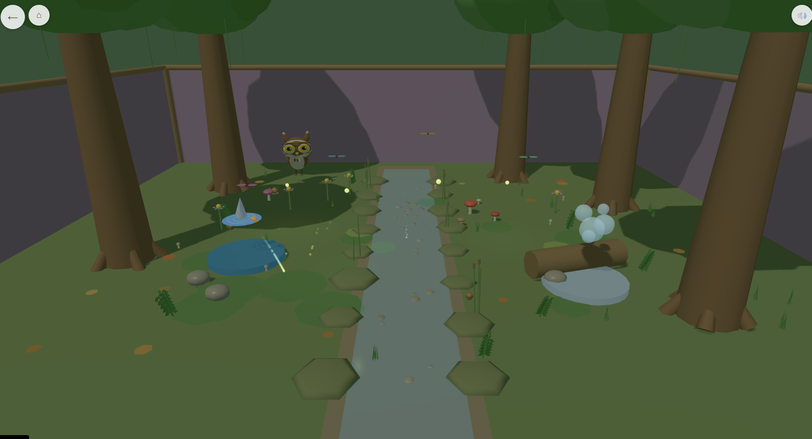
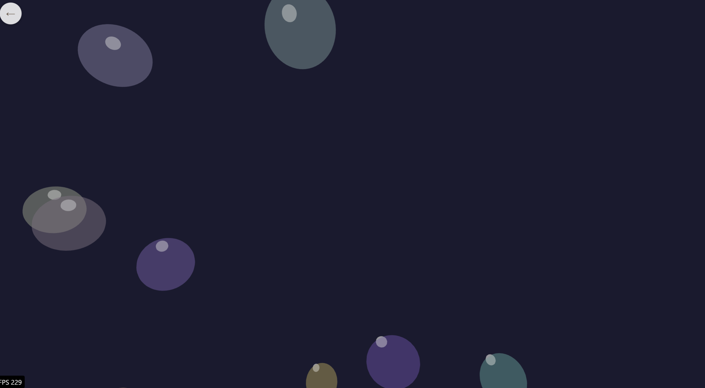

# Tiny Toybox Games

A magical browser-based 3D experience for children ages 3-6. Move through a whimsical world, enter the House's Playroom, open a toybox, and explore living miniature scenes filled with sparkles, sounds, and surprises without reading a single word.

**Play it now: [tinytoyboxgames.com](https://www.tinytoyboxgames.com/)**


> _"The player should feel like they are peeking into a tiny living world inside a toybox."_

---

## What Is This?

Tiny Toybox Games is a real-time 3D interactive experience rendered with **Three.js** inside a **React** app shell. It runs entirely in the browser: no install, no app store, no accounts, and no browser persistence.

---

## Current Implemented Slice

The current build exposes a small but real slice of the larger architecture:

- a Nature toybox immersive scene, currently still loaded through the historical `naturescene` path
- four play-mode minigames launched from Nature
- a shared owl companion that appears in every navigable non-minigame scene

### Playroom Landing Scene

The experience opens in a warm afternoon playroom scene. In the target hierarchy this is the `Playroom` sub-place inside `House`.

Inside you'll find:

- hand-crafted toyboxes arranged around a central play rug
- a plush owl companion that hops, blinks, head-tracks, and reacts to taps
- living toy critters such as wind-up mice, hopping chicks, and passing toy trains
- ambient details including dust motes, cozy lighting, wallpaper, wall art, bookshelves, hanging mobiles, and floor toys
- procedural audio for taps, ambience, and transitions
- first-tap fallback so there are no dead taps

### Nature Toybox Immersive Scene

Open the Nature toybox and you enter a tiny forest-floor diorama: deep greens, mossy textures, firefly golds, and calm tactile interactions. Mushrooms bounce, flowers bloom, leaves flip, the stream ripples, and gentle effects reward curiosity immediately.



### Current Playable Minigames

The current manifest launches four minigames from the Nature immersive scene:

| Game             | What You Do                                                           |
| ---------------- | --------------------------------------------------------------------- |
| **Bubble Pop**   | Pop shimmering bubbles in the night sky with soft splats and sparkles |
| **Fireflies**    | Catch glowing fireflies in a jar and fill the scene with warm light   |
| **Little Shark** | Chase and tap colorful fish in a cheerful underwater play space       |




All four minigames are play modes, not navigable scenes. They share the same constraints:

- no fail states
- one-tap exit
- icon-first HUD
- age-3 accessibility floor
- no browser persistence

### Everything Is Code-Generated

No textures, no 3D model files, and no audio files are required for the baseline experience. Meshes, materials, particles, and sound are authored in TypeScript and generated at runtime.

- **Procedural meshes** - toyboxes, owl, props, creatures, and scene geometry are built from code
- **Procedural audio** - Web Audio synthesis creates music, sound effects, and ambience in real time
- **Procedural particles** - sparkles, bubbles, confetti, and celebration effects are all runtime systems

---

## Technology Stack

| Layer                     | Choice                             |
| ------------------------- | ---------------------------------- |
| Language                  | TypeScript (strict mode)           |
| UI Framework              | React 18+                          |
| 3D Engine                 | Three.js with React Three Fiber    |
| Animation                 | GSAP 3.x                           |
| Build Tool                | Vite 6.x                           |
| Runtime / Package Manager | Bun 1.x                            |
| Deployment                | Docker (multi-stage build + nginx) |

---

## Design Principles

| Principle                        | What It Means                                                                                 |
| -------------------------------- | --------------------------------------------------------------------------------------------- |
| **Delight within the first tap** | Every interaction produces an immediate, satisfying response                                  |
| **No reading required**          | The experience works for pre-literate children through visual affordance and sensory feedback |
| **Zero persistence**             | No localStorage, cookies, IndexedDB, or browser-stored app data                               |
| **Browser-first**                | A URL is the only install flow                                                                |
| **Warmth over complexity**       | Fidelity comes from lighting, materials, and motion rather than content sprawl                |
| **Open-ended play**              | Toy, not test. Enter, explore, leave, and return freely                                       |

---

## Getting Started

```bash
cd src
bun install
bun run dev
```

Open `http://localhost:5173` and start tapping.

### Docker

```bash
docker build -t tinytoybox .
docker run -p 8080:80 tinytoybox
```

The container includes an nginx server with a `/health` endpoint for load balancer health checks.

---

## Project Structure

```text
Dockerfile
nginx.conf
src/
  src/
    App.tsx
    bootstrap/      # Storage guard bootstrap and early app boot
    components/     # React shell, router, canvas lifecycle, overlays
    entities/       # Shared entities such as the owl companion
    hooks/          # Custom hooks and shell helpers
    minigames/      # Minigame framework + game implementations
    scenes/         # Current legacy scene ids plus migration toward recursive scene hierarchy
    types/          # TypeScript type definitions
    utils/          # Shared utilities
docs/
  adr/             # Architecture decisions
  ai-guidance/     # AI collaborator context
  specs/           # Product and technical specs
  controlled-terminology.md
  readme-assets/
```

---

## Content Generators

Three generators scaffold new content from canonical templates. Run them from `src/`:

```bash
# New immersive toybox scene
npm run create:immersive-scene -- --scene-id coral-reef --display-name "Coral Reef"

# New room scene (sub-place)
npm run create:room-scene -- --scene-id bedroom --display-name "Bedroom"

# New minigame
npm run create:minigame -- --game-id star-catcher --display-name "Star Catcher"
```

Each generator copies a governed template, replaces placeholder tokens, registers the result in the appropriate manifest, and prints next steps. See the template READMEs for full details:

- [Immersive scene template](src/templates/immersive-scene/README.md)
- [Room scene template](src/templates/room-scene/GENERATED_README.md.template)
- [Minigame template](src/templates/minigame/README.md)

---

## Documentation

- [**AI Guidance**](docs/ai-guidance/) - Vision, design soul, agent roles, and skill definitions used by AI collaborators
- [**Controlled Terminology**](docs/controlled-terminology.md) - Canonical glossary of names, labels, and structure terms
- [**Recursive Scene Hierarchy Spec**](docs/specs/phase-3/11-recursive-scene-hierarchy-spec.md) - Canonical scene, toybox, owl, and minigame model
- [**Migration Plan**](docs/specs/phase-3/12-recursive-scene-hierarchy-migration-plan.md) - Ordered path from `hub` / `naturescene` to the target hierarchy

---

## License

This project is licensed under the [MIT License](LICENSE).
