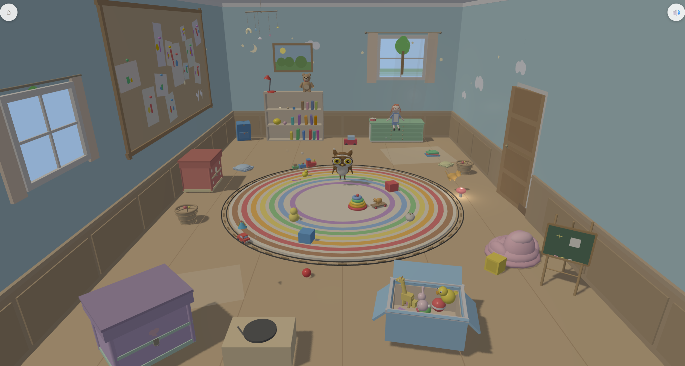

# Tiny Toybox Games

Tiny Toybox Games is a browser-based 3D play experience for ages 3-6.
The current repo contains a playable Playroom and Kitchen, two toybox immersive scenes (Nature and Pirate Cove), five registered minigames, and shared runtime scaffolding for procedural art, procedural audio, and memory-only browser play.

**Play it now: [tinytoyboxgames.com](https://www.tinytoyboxgames.com/)**



> _"The player should feel like they are peeking into a tiny living world inside a toybox."_

---

## What This Repo Currently Contains

This repository includes a real playable slice of the larger architecture.

### Current scenes

The current scene catalog registers four navigable scenes:

- **Playroom** (`playroom`) — landing scene
- **Kitchen** (`kitchen`) — landing scene
- **Nature** (`nature`) — immersive toybox scene
- **Pirate Cove** (`pirate-cove`) — immersive toybox scene

### Current toybox destinations

#### Playroom

The Playroom currently contains three visible toybox-like destinations:

- **Adventure** → opens **Pirate Cove** (active)
- **Animals** → opens **Nature** (active)
- **Creative** → present but **inactive** (destination is `null`)

#### Kitchen

The Kitchen currently contains one active toybox:

- **Kitchen Nature** → opens **Nature** (active)

### Current minigames

The current minigame manifest registers five games:

| Game | Launchable from | Status |
|---|---|---|
| **Bubble Pop** | Nature | registered |
| **Fireflies** | Nature | registered |
| **Little Shark** | Nature | registered |
| **Star Catcher** | Nature | registered |
| **Cannonball Splash** | Pirate Cove | registered |

### What is currently discoverable in the UI

A normal player can currently reach these minigames through in-scene portals:

- From **Nature**: Bubble Pop, Little Shark, Fireflies
- From **Pirate Cove**: Cannonball Splash

`Star Catcher` is registered in the manifest and deep-link launchable, but not yet surfaced through Nature's portal layout.

---

## Architecture Direction

The repo is moving toward a larger recursive scene hierarchy, but this README describes only what is currently in the build.

Today's code already includes:

- a React app shell with hash-based routing
- direct Three.js scene lifecycle ownership
- lazy scene loading and lazy minigame loading
- shared room-scene and world-scene factories
- a shared owl companion in every navigable non-minigame scene
- generator-based scaffolding for immersive scenes, room scenes, and minigames

### Everything is code-generated

No textures, no 3D model files, and no audio files are required for the baseline experience. Meshes, materials, particles, and sound are authored in TypeScript and generated at runtime.

- **Procedural meshes** — toyboxes, owl, props, creatures, and scene geometry are built from code
- **Procedural audio** — Web Audio synthesis creates music, sound effects, and ambience in real time
- **Procedural particles** — sparkles, bubbles, confetti, and celebration effects are all runtime systems

---

## Zero-Persistence Runtime Policy

The app bootstraps with a storage-guard module that blocks browser persistence APIs before React loads.

The current runtime explicitly patches or blocks:

- `localStorage`
- `sessionStorage`
- `document.cookie` writes
- `indexedDB`
- Cache API app-state usage

The intended app model is memory-only for the current page lifecycle.

---

## Technology Stack

| Layer | Choice |
|---|---|
| Language | TypeScript `~5.9.3` (strict mode) |
| UI Framework | React `19.2.0` |
| 3D Engine | Three.js `0.175.0` with React Three Fiber `9.1.0` and drei `10.0.0` |
| Animation | GSAP `3.12.0` |
| Build Tool | Vite `7.3.1` |
| Deployment | Docker (multi-stage build + nginx) |

Note: the repo currently contains both `bun.lock` and `package-lock.json`. Until one package-manager story is standardized, do not describe Bun as the only supported workflow.

---

## Design Principles

| Principle | What It Means |
|---|---|
| **Delight within the first tap** | Every interaction produces an immediate, satisfying response |
| **No reading required** | The experience works for pre-literate children through visual affordance and sensory feedback |
| **Zero persistence** | No localStorage, cookies, IndexedDB, or browser-stored app data |
| **Browser-first** | A URL is the only install flow |
| **Warmth over complexity** | Fidelity comes from lighting, materials, and motion rather than content sprawl |
| **Open-ended play** | Toy, not test. Enter, explore, leave, and return freely |

---

## Getting Started

```bash
cd src
bun install
bun run dev
```

If you prefer npm-based workflows, verify them against `src/package.json` and the lockfiles present in the repo.

Open `http://localhost:5173` and start tapping.

### Docker

```bash
docker build -t tinytoybox .
docker run -p 8080:80 tinytoybox
```

The container includes an nginx server with a `/health` endpoint for load balancer health checks.

---

## Project Structure

```text
Dockerfile
nginx.conf
src/
  src/
    App.tsx
    bootstrap/      # Storage guard bootstrap and early app boot
    components/     # React shell, router, canvas lifecycle, overlays
    entities/       # Shared entities such as the owl companion
    hooks/          # Custom hooks and shell helpers
    minigames/      # Minigame framework + game implementations
    scenes/         # Scene catalog, room scenes, immersive scenes
    types/          # TypeScript type definitions
    utils/          # Shared utilities
docs/
  adr/             # Architecture decisions
  ai-guidance/     # AI collaborator context
  specs/           # Product and technical specs
  status/          # Canonical current-state documentation
  controlled-terminology.md
  readme-assets/
```

---

## Content Generators

Three generators scaffold new content from canonical templates. Run them from `src/`:

```bash
# New immersive toybox scene
npm run create:immersive-scene -- --scene-id coral-reef --display-name "Coral Reef"

# New room scene (sub-place)
npm run create:room-scene -- --scene-id bedroom --display-name "Bedroom"

# New minigame
npm run create:minigame -- --game-id star-catcher --display-name "Star Catcher"
```

Each generator copies a governed template, replaces placeholder tokens, registers the result in the appropriate manifest, and prints next steps.

---

## Documentation Map

Start here:

- [`docs/status/current-state.md`](docs/status/current-state.md) — canonical current repo surface area
- [`docs/ai-guidance/CLAUDE.md`](docs/ai-guidance/CLAUDE.md) — internal LLM operating guidance
- [`docs/controlled-terminology.md`](docs/controlled-terminology.md) — canonical naming and state vocabulary
- [`docs/ai-guidance/agents.md`](docs/ai-guidance/agents.md) — AI collaboration model

For architecture and specs:

- [Recursive Scene Hierarchy Spec](docs/specs/phase-3/11-recursive-scene-hierarchy-spec.md)
- [Migration Plan](docs/specs/phase-3/12-recursive-scene-hierarchy-migration-plan.md)

---

## License

This project is licensed under the [MIT License](LICENSE).
